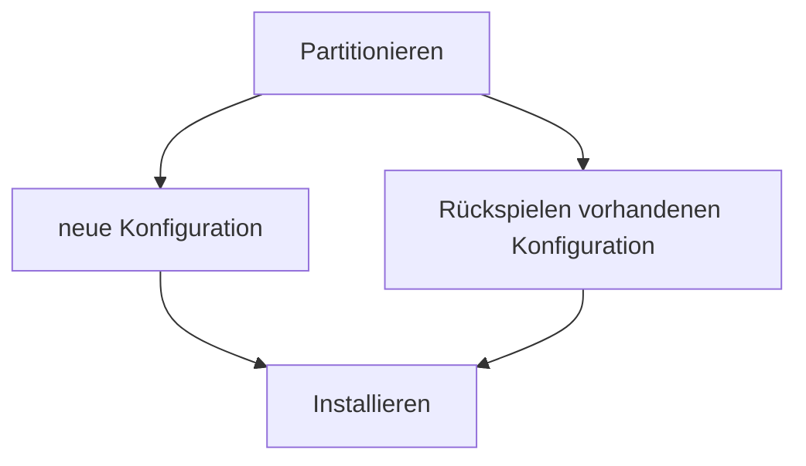

# Wiederanlaufplan für das Betreiben eines Tor-Relays

## Installation von NixOS 

Nach dem Booten eines Live-Sticks auf einer Maschine oder VM sollten folgende Befehle ausgeführt werden:

- sudo parted /dev/sda -- mklabel msdos
- sudo parted /dev/sda -- mkpart primary 1MB 100%
- sudo parted /dev/sda -- set 1 boot on
- sudo mkfs.ext4 -L nixos /dev/sda1
- lsblk -f
- sudo mount /dev/disk/by-label/nixos /mnt/

- sudo mkdir -p /mnt/boot
- sudo nixos-generate-config --root /mnt/
- sudo nano /mnt/etc/nixos/configuration.nix

- sudo nixos-install

## Implementierung der Konfigurationsdateien Repositories auf dem Server

- cd /etc/nixos
- git clone "Hier die Adresse dieses Repositories hinzufügen" ##klonen des Verzeichnisses auf die lokale Maschine

### Hinweise: 

Mit sudo "parted /dev/sda -- print" kann die aktuelle Konfiguration angezeigt werden. Zudem gibt es den Befehl "lsblk", mit dem die Blockdevices angezeigt werden können. 

